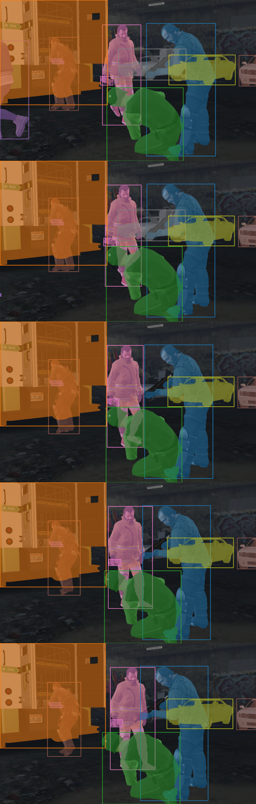
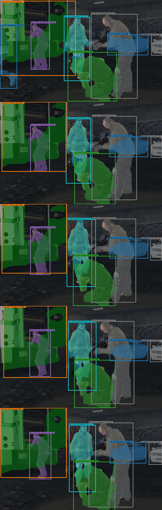
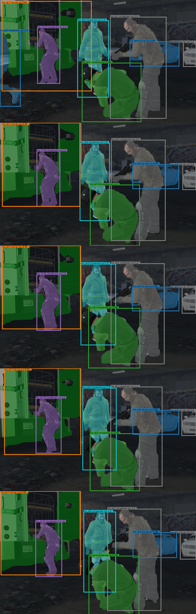
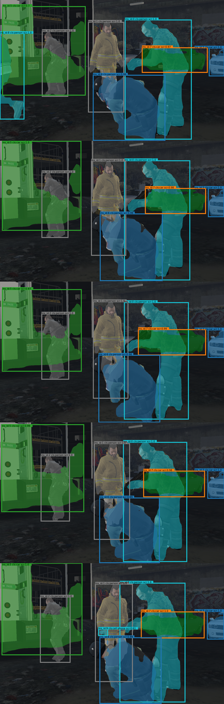
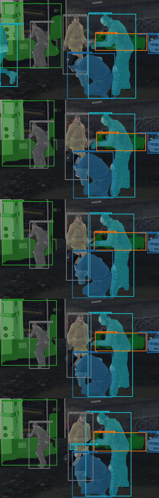

# Implementations of Video Instance Segmentation methods on amodal video datasets 

## Datasets:
[SAIL-VOS](https://sailvos.web.illinois.edu/_site/index.html) & SAIL-VOScut (videos split into video-cuts without abrupt scene change)

amodal annotations: &emsp;&emsp;&emsp;&emsp;&emsp;&emsp;&emsp;&emsp;&emsp;&emsp;&emsp;&emsp;&emsp;&emsp;&emsp;&emsp;&emsp; visible annotations:

 &emsp; &emsp; 

## Amodal & Visible: QDTrack-mots-joint(+)
Using joint construction of the functional heads (Mask Heads / BBox Heads) in the original Mask R-CNN architecture of [QDTrack-mots](https://github.com/SysCV/qdtrack) for joint training research.

> **QDTrack-mots-joint testing results:**

amodal results: &emsp;&emsp;&emsp;&emsp;&emsp;&emsp;&emsp;&emsp;&emsp;&emsp;&emsp;&emsp;&emsp;&emsp;&emsp;&emsp;&emsp;&emsp;&emsp; visible results:

 &emsp; &emsp; 

> **QDTrack-mots-joint+ testing results:**

amodal results: &emsp;&emsp;&emsp;&emsp;&emsp;&emsp;&emsp;&emsp;&emsp;&emsp;&emsp;&emsp;&emsp;&emsp;&emsp;&emsp;&emsp;&emsp;&emsp; visible results:

 &emsp; &emsp; 


## Amodal / Visible:  
Please refer to [QDTrack](https://github.com/SysCV/qdtrack) for details of (Amodal)QDTrack-mots 
Please refer to [PCAN](https://github.com/SysCV/pcan) for details of (Amodal)PCAN

## References
```
@inproceedings{hu2019sail,
  title={Sail-vos: Semantic amodal instance level video object segmentation-a synthetic dataset and baselines},
  author={Hu, Yuan-Ting and Chen, Hong-Shuo and Hui, Kexin and Huang, Jia-Bin and Schwing, Alexander G},
  booktitle={Proceedings of the IEEE/CVF Conference on Computer Vision and Pattern Recognition},
  pages={3105--3115},
  year={2019}
}
@inproceedings{pang2021quasi,
  title={Quasi-dense similarity learning for multiple object tracking},
  author={Pang, Jiangmiao and Qiu, Linlu and Li, Xia and Chen, Haofeng and Li, Qi and Darrell, Trevor and Yu, Fisher},
  booktitle={Proceedings of the IEEE/CVF conference on computer vision and pattern recognition},
  pages={164--173},
  year={2021}
}
@inproceedings{pcan,
  title={Prototypical Cross-Attention Networks for Multiple Object Tracking and Segmentation},
  author={Ke, Lei and Li, Xia and Danelljan, Martin and Tai, Yu-Wing and Tang, Chi-Keung and Yu, Fisher},
  booktitle={Advances in Neural Information Processing Systems},
  year={2021}
}
